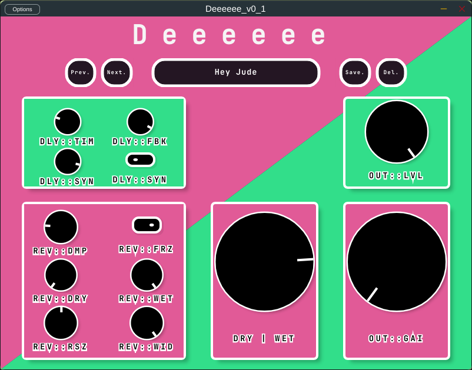

# D E E E E E E
## Delay and Reverb VST Plug-in for your favorite DAW.

#### Context
This plugin is the first of a series of three that I am developing during my spare time. I have set myself the personal goal of programming a different plugin each month, both to become more comfortable with JUCE and with C++.

For this first plugin, I wanted to start simply with an audio effect. I therefore chose to implement a delay and reverb. I developed the Delay myself but I used the reverb from JUCE (juce::dsp::reverb).

As so, there are many ways from which I can improve the code, mainly : 
  - Make use of the juce::ProcessorChain and therefore, make the Delay compliant to its needs. I still not quite understand how to write the process() and prepare() methods for my Delay.
  - Template the Delay. By now it only uses a Float stereo juce::AudioBuffer.

#### Prerequities
This plugin uses local presets that are normally present in these directories depending on your OS: 

- On Linux:   ~/.config/CanyonTeam/Deeeeee_v_x_x/Presets/
- On MacOS:   ~/Library/CanyonTeam/Deeeeee_v_x_x/Presets/
- On Windows: \Documents and Settings\username\Application Data\CanyonTeam\Deeeeee_v_x_x\Presets

Once the plugin went through first run, it should have created the various folders
constituting the preset path on your system (unless it doesn't own the rights to).

Therefore, you must place, after first run, the content of the *Resources* folder
inside the corresponding Presets folder of your OS.

⚠️ **Please consider this as a temporary solution.** ⚠️

I am leaving within the assets folder the standalone and VST3 version of the plugin (compiled with clang-18). You can only use them under a Linux x86_64 machine. If you want to try the plugin by yourself and don't run a Linux machine, please consider building the plugin on your own but feel free to ask me if any help is needed.

**PS: Thanks a lot to [Sudara](https://melatonin.dev/) for its incredible [Pamplejuce](https://github.com/sudara/pamplejuce) template!**
